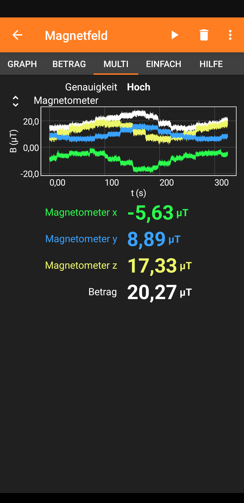

# RF Gas Meter

Situation: I want to log gas consumption over time.

My gas meter (Pipersberg G4 RF1) is interesting. It has a spinning magnet inside -> we can read consumption with a magnetometer. First tests with phyphox on my phone were really promising: 

Problem:
Gas meter is in the basement without power or wifi.

Solution: 
Use low power RF with low datarate but high reach.
Options:
- LoRa (without the WAN part) would work nicely, but I found no convenient prebuild battery-powered board.
- RFM69 based: similar performance, and I found the Radio Node Mini by OpenHomeSecurity.

Very low power consumption in sleep mode. We might have some more, since we have to be awake to do periodic magnetometer measurements quite often (?)

TODO: figure out how to map magnetometer to meter
TODO: figure out how often we have to wake. What is the maximum speed my gas meter turns? Sample theorem -> 2x that we have to wake at least. Since we likely don't want to do fancy math, maybe just a min/max with histeresis, we'll have to sample a bit more often than that tho.

TODO: figure out if the range of the module is enough

RPI Zero W pinout:
https://i.stack.imgur.com/yHddo.png

RPI Zero get decent uart serial:
/boot/cmdline.txt -> remove serial0
/boot/config.txt -> add

```
# Switch serial ports
dtoverlay=miniuart-bt
enable_uart=1
core_freq=250

```


### How to program?
The board behaves as an "official" Arduino Pro Mini would and is shipped with the normal arduino bootloader installed.

To program it, I connect an ft232 (with exposed DTR pin for auto-reset) to the FTDI header on the board. You can then simply use the official Arduino IDE and set a Pro Mini as target.

Alternatively, I use avrdude. Confusingly, you have to use `arduino` as programmer, and not `ft232r`, which tripped me up for a bit. I presume that is because we are NOT flashing a bootloader, but using an installed arduino bootloader, so the "programmer" we have to speak to is not the ft232, but the arduino bootloader which in turn is spoken to via serial comms, that the kernel handles for us, no ft232 is directly exposed to avrdude in this case.

For a non-destructive test you can dump the currently flashed firmware with

`avrdude -p m328p -carduino -P/dev/ttyUSB0 -b 57600 -U flash:r:flash.bin:r`

Note that we also specify the baudrate to be 57600. The default would be 115200. The latter is the default for the bootloaders of Arduino Unos and newer nanos, so is also the default of avrdude. 57600 is default for older (pre 2018?) nanos and the pro. You can see this in the [the arduino avr boards definition](https://github.com/arduino/ArduinoCore-avr/blob/master/boards.txt):

`pro.menu.cpu.16MHzatmega328.upload.speed=57600`


### BOM
- Radio Node Mini
- GY-271 Magnetometer
- 3.7V LiPo Battery
- MCP9808 Temp Sensor

#### Radio Node Mini
Based on the excellent Radio Node Mini by vysocan:

- Original Code: https://github.com/vysocan/radio_node_mini
- Datasheet: https://drive.google.com/file/d/1RUU-dO8BQ4yoZs5goaZcnSl0Y4RCWnYg/view
- Where to Buy: https://www.tindie.com/products/vysocan/rfm69-radio-node-mini/
- Blog Announcement: https://openhomesecurity.blogspot.com/2018/03/new-wireless-mini-node.html

Size: ~35x25mm

Node does NOT get power over USB. Either battery or FTDI.

FTDI header is nice, I soldered headers and can directly plug in my FTDI module, pinout is compatible, no wires needed.

My boards came shipped with the "default" firmware from the above repo.

Also considered the very similar _LowPowerLab Moteino_, but the ones available in Germany from welectron.com cost more and were missing the charging circutry.


#### RFM69 Radio Module
There are different versions of the RFM69 with different pinouts.
For a Visual identification you can refer to [Moteino's Transceiver Page](https://lowpowerlab.com/guide/moteino/transceivers/).

I have the "discontinued" RFM69HW

##### Testing
Flash one board with `node_test`, the other with `PiGatewaySimple`

##### Optimizing range.
Default: I receive (after retries!) only ~50% of packages on cellar. Lets improve settings for the RFM69.

Default:
FSK, no shaping, 55k baud, 5kHz deviation.

Datasheet tells us we get -120dBm when:
- Using FSK with 5kHz FDA using 1200 baud, and setting SensitivityBoot in `RegTestLna` to 0x2D.

Change Registers:
- RegBitrate* (0x04/0x05): Set bitrate to 1200 baud
- RegTestLna (0x58): Controlls Sensitivity Boost. Use 0x2D for High sensitivity mode.


#### Magnetormeter
Don't have to be too accurate I think, just pick any. 
GY-271 seems widely available, based on QMC5883.
Board has a temp sensor as well, but no idea how accurate. +"offset" is not calibrated according to datasheet.

Can be modded to remove voltage regulator.
https://bengoncalves.wordpress.com/2015/10/02/arduino-power-down-mode-with-accelerometer-compass-and-pressure-sensor/


#### Battery.
Internet says LiFePO4 is nice, because it has a nice discharge curve at ~3.3V, and we can omit the voltage regulator, which uses additional energy.

Board has a [MCP1700T-3302E/TT](https://ww1.microchip.com/downloads/en/DeviceDoc/MCP1700-Low-Quiescent-Current-LDO-20001826E.pdf) low-dropout voltage regulator, that requires ~170mV above output voltage as input.

It has built-in overcurrent protection, with a maximum current of 250mA. It does NOT have under voltage protection.

Board has charging onboard, with an [MCP73831](https://ww1.microchip.com/downloads/en/DeviceDoc/MCP73831-Family-Data-Sheet-DS20001984H.pdf):
- single-cell charge management controller for li-ion and li-polimer batteries.
- Vreg (target battery voltage) is 4.2V (which is the minimum of this chip).
-> LiFePo4 NOT viable. Use normal LiPo 3.7V which goes up to 4.2V when fully charged.

We have regulator anyways, so no need for LiFePo4, and build-in charging is nice to have.

-> Go with generic Lipo Akku 700mAh 3,7V 25C/50C one that has ~size of board.


#### Temperature Sensor
Just for kicks, maybe correlating temp in cellar with gas-usage? Temp in cellar should track outside-temp, but is influenced by house insulation somewhat?

MCP9808 is "high accuracy" whatever that means. Not much more expensive than common DT11/DT22 ones, so lets get it.


## Links
- https://www.kompf.de/tech/gascountmag.html
- https://jackgruber.github.io/2019-12-27-Low-power-Arduino-Pro-Mini/
- https://bengoncalves.wordpress.com/2015/10/02/arduino-power-down-mode-with-accelerometer-compass-and-pressure-sensor/